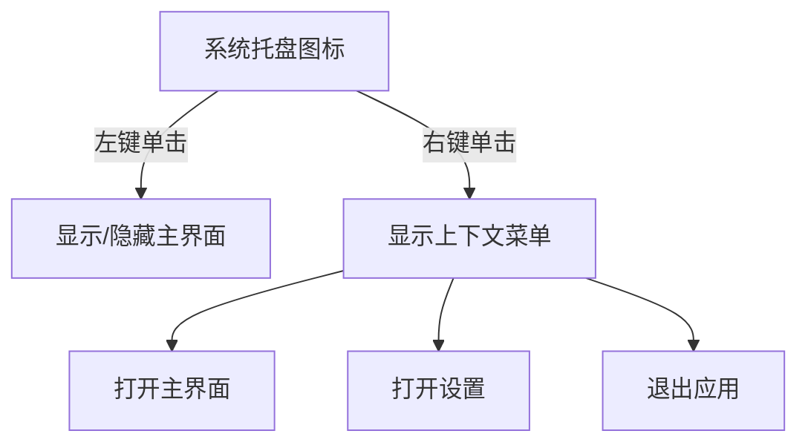

## 1. 产品概述
AI壁纸应用是一款跨平台桌面应用，用户通过输入文本提示词，调用云端AI API生成个性化壁纸并自动设置为电脑壁纸。应用支持macOS和Windows系统，提供系统托盘快速访问和本地缓存功能。

目标用户：追求个性化桌面体验的电脑用户，设计师，AI艺术爱好者。产品价值：简化壁纸获取流程，提供无限创意可能，提升桌面美观度。

## 2. 核心功能

### 2.1 用户角色
本应用为单用户应用，无需区分用户角色。所有用户均可使用完整功能。

### 2.2 功能模块
AI壁纸应用包含以下核心页面：
1. **主界面**：壁纸生成输入区、生成按钮、历史记录展示
2. **设置界面**：API配置、缓存管理、关于信息

### 2.3 页面详情
| 页面名称 | 模块名称 | 功能描述 |
|---------|---------|----------|
| 主界面 | 提示词输入区 | 接收用户输入的文本提示词，支持多行文本输入 |
| 主界面 | 生成按钮 | 点击触发AI壁纸生成流程，显示加载状态 |
| 主界面 | 分辨率选择 | 自动检测并显示当前屏幕分辨率，支持手动修改 |
| 主界面 | 历史记录 | 展示本地缓存的生成历史，支持点击查看和重新设置 |
| 主界面 | 预览区域 | 显示生成的壁纸缩略图，支持放大查看 |
| 设置界面 | API配置 | 配置AI API的接入地址和认证信息 |
| 设置界面 | 缓存管理 | 查看缓存大小，支持清理缓存 |
| 设置界面 | 关于信息 | 显示应用版本和开发者信息 |

## 3. 核心流程

### 3.1 壁纸生成流程
用户点击系统托盘图标打开主界面 → 输入提示词 → 点击生成按钮 → 应用获取屏幕分辨率 → 调用AI API生成壁纸 → 下载图片到本地缓存 → 自动设置为系统壁纸 → 更新历史记录

### 3.2 系统托盘交互流程

## 4. 用户界面设计

### 4.1 设计风格
- **主色调**：深色主题（#1a1a1a）搭配蓝色强调色（#3b82f6）
- **按钮样式**：圆角矩形，悬停效果，加载状态显示
- **字体**：系统默认字体，标题16px，正文14px
- **布局风格**：卡片式布局，简洁现代
- **图标风格**：使用系统原生图标和emoji

### 4.2 页面设计概述
| 页面名称 | 模块名称 | UI元素 |
|---------|---------|--------|
| 主界面 | 提示词输入区 | 圆角文本框，占位符提示，支持自动聚焦 |
| 主界面 | 生成按钮 | 蓝色渐变按钮，生成时显示加载动画 |
| 主界面 | 历史记录 | 网格布局显示缩略图，悬停显示操作按钮 |
| 设置界面 | API配置 | 表单输入框，支持测试连接功能 |
| 设置界面 | 缓存管理 | 显示当前缓存大小，清理按钮带确认对话框 |

### 4.3 响应式设计
桌面优先设计，界面大小固定为800x600像素，不支持缩放。在高分屏上保持清晰显示。

### 4.4 系统托盘设计
- 图标：简洁的壁纸图标，支持深色/浅色主题切换
- 提示：悬停显示"AI壁纸生成器"
- 菜单：原生系统菜单风格，支持快捷键