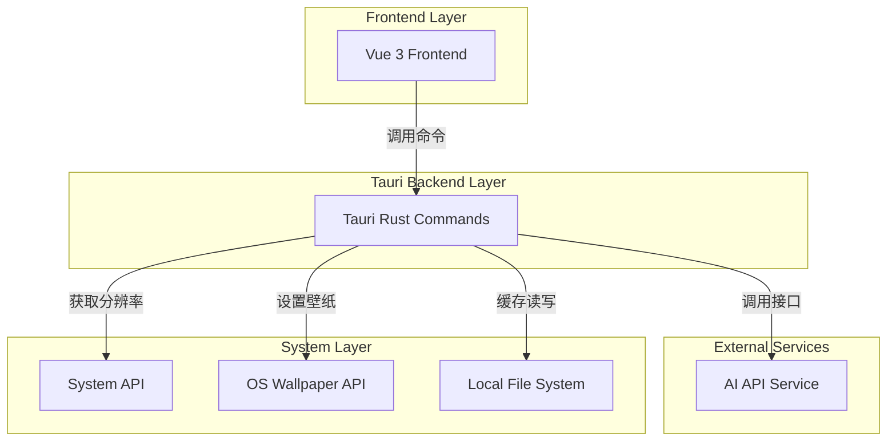
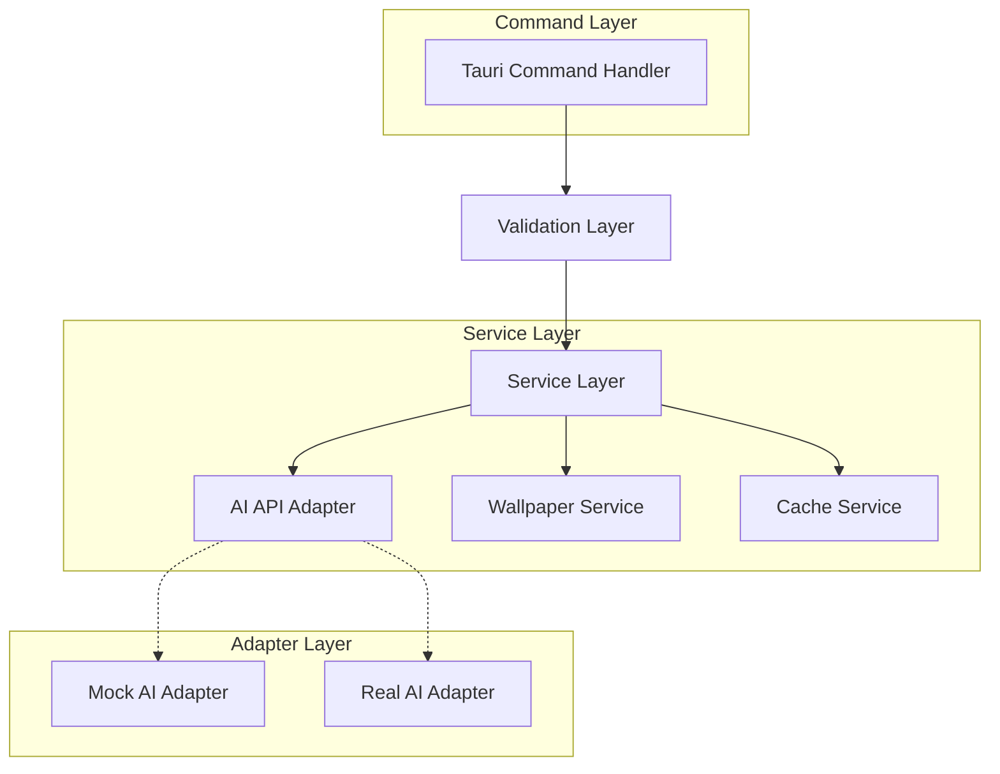

## 1. 架构设计



## 2. 技术描述

- **前端**: Vue 3 + Tailwind CSS + Vite
- **初始化工具**: create-tauri-app
- **后端**: Tauri (Rust)
- **系统交互**: Rust系统API调用
- **构建工具**: Cargo (Rust) + Vite (前端)

## 3. 路由定义

| 路由 | 用途 |
|------|------|
| / | 主界面，壁纸生成和历史记录 |
| /settings | 设置界面，API配置和缓存管理 |

## 4. API定义

### 4.1 Tauri命令定义

**生成壁纸**
```rust
#[tauri::command]
async fn generate_wallpaper(prompt: String, width: u32, height: u32) -> Result<String, String>
```

**获取屏幕分辨率**
```rust
#[tauri::command]
fn get_screen_resolution() -> Result<(u32, u32), String>
```

**设置壁纸**
```rust
#[tauri::command]
async fn set_wallpaper(image_path: String) -> Result<(), String>
```

**获取历史记录**
```rust
#[tauri::command]
fn get_wallpaper_history() -> Result<Vec<WallpaperRecord>, String>
```

**清理缓存**
```rust
#[tauri::command]
fn clear_cache() -> Result<(), String>
```

### 4.2 数据结构定义

```typescript
interface WallpaperRecord {
  id: string;
  prompt: string;
  imagePath: string;
  createdAt: number;
  resolution: {
    width: number;
    height: number;
  };
}

interface GenerateRequest {
  prompt: string;
  width: number;
  height: number;
}

interface GenerateResponse {
  success: boolean;
  imagePath?: string;
  error?: string;
}
```

## 5. 服务架构设计



## 6. 数据模型

### 6.1 本地文件结构
```
~/.ai-wallpaper-app/
├── cache/
│   ├── images/
│   │   ├── {uuid}.png
│   │   └── ...
│   └── history.json
└── config.json
```

### 6.2 配置文件结构

**config.json**
```json
{
  "api": {
    "provider": "mock",
    "endpoint": "",
    "apiKey": "",
    "model": ""
  },
  "cache": {
    "maxSize": "1GB",
    "autoCleanup": true
  },
  "ui": {
    "theme": "dark"
  }
}
```

**history.json**
```json
{
  "records": [
    {
      "id": "uuid",
      "prompt": "beautiful sunset",
      "imagePath": "~/.ai-wallpaper-app/cache/images/uuid.png",
      "createdAt": 1640000000000,
      "resolution": {
        "width": 1920,
        "height": 1080
      }
    }
  ]
}
```

## 7. AI API接口设计

### 7.1 Mock接口实现
```rust
pub trait AiApiAdapter {
    async fn generate_image(&self, prompt: &str, width: u32, height: u32) -> Result<Vec<u8>, String>;
}

pub struct MockAiAdapter;

impl AiApiAdapter for MockAiAdapter {
    async fn generate_image(&self, prompt: &str, width: u32, height: u32) -> Result<Vec<u8>, String> {
        // 生成纯色图片作为Mock数据
        Ok(generate_solid_color_image(width, height))
    }
}
```

### 7.2 真实API适配器
支持以下AI服务（可配置切换）：
- OpenAI DALL-E
- Stability AI
- Midjourney (通过第三方API)
- 其他自定义API

## 8. 系统兼容性

### 8.1 壁纸设置实现
- **macOS**: 使用`osascript`命令设置桌面壁纸
- **Windows**: 使用Windows API或注册表设置壁纸
- **Linux**: 支持主流桌面环境（GNOME, KDE等）

### 8.2 屏幕分辨率获取
- **macOS**: Core Graphics API
- **Windows**: Win32 API
- **Linux**: X11或Wayland协议